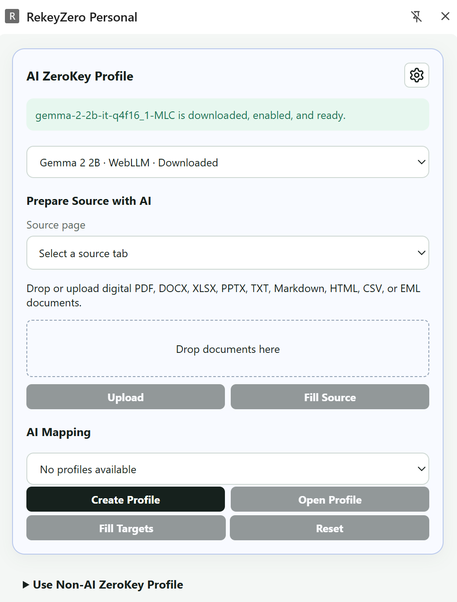

# RekeyZero

[](https://github.com/newmind-gh/RekeyZeroExtension/actions/workflows/ci.yml)


<h2 align="center">Stop re-keying data between web applications.</h2>

<p align="center"><strong>AI maps. RekeyZero fills. You review and submit.</strong></p>

RekeyZero is an open-source Chromium extension for safely reusing information from one open web page across one or more target pages. Create reusable Mapping Profiles, fill supported controls through a guarded deterministic executor, review the result, and submit manually.

AI is optional. When enabled, it can propose field relationships, but it does not control the browser, execute arbitrary JavaScript or selectors, or submit forms for you.

[Try the synthetic live demo](https://newmind-gh.github.io/RekeyZeroExtension/) · [Watch the actual extension walkthrough](https://newmind-gh.github.io/RekeyZeroExtension/walkthrough.webm)

The demo uses synthetic records and the real extension. AI matching is optional; the recorded walkthrough uses a manually reviewed Profile. Demo Submit opens a local preview only.


## What RekeyZero does

A typical RekeyZero workflow looks like this:

```text
Source web app
     │
     │ observe current fields and values
     ▼
Mapping Profile
     │
     ├── map fields manually
     │        or
     └── let AI propose field relationships
              │
              ▼
     deterministic validation
              │
              ▼
        guarded fill plan
              │
              ▼
        target web app(s)
              │
              ▼
       review and submit
```

For example, a reusable profile might map:

```text
Customer Name   → Applicant Name
Company         → Business Name
Street Address  → Address
Postcode        → Postal Code
```

The profile stores page and field identities plus mapping policy. It does **not** store the current source-field values. Each **Fill** re-observes the matching open pages and uses the current source data for that transfer batch.

## Why RekeyZero

### Deterministic execution

AI can help determine which fields correspond to each other, but accepted mappings are executed by the same guarded, deterministic fill engine used by non-AI profiles.

RekeyZero does not execute arbitrary model-generated JavaScript or selectors, does not perform unattended navigation, and does not perform final submission.

### User-controlled filling

For each mapped target field, a profile can specify whether RekeyZero should:

- fill only when the field is blank;
- allow overwrite; or
- never fill the field.

Stale or changed page state invalidates prepared actions, and unsupported or ambiguous operations stop for user review.

### Browser-local product state

RekeyZero does not require a RekeyZero backend. Durable product state is kept in browser IndexedDB. Active transfer batches and API keys use extension session storage.

### AI is optional

Use **ZeroKey Profile** for fully manual field mapping, or **AI ZeroKey Profile** to ask a model to propose field relationships.

AI matching receives field labels, control types, groups, and accepted options. It does not receive current source-field values.

Current model options include:

- Qwen2.5 1.5B and Gemma 2 2B through browser-local WebLLM;
- Gemini through its direct API;
- DeepSeek through its direct API; and
- GPT through the OpenAI API, defaulting to `gpt-5.6-terra`.

For API models, requests go directly from the extension to the selected provider. There is no RekeyZero proxy. API keys remain in extension session storage and must be entered again after the browser restarts.

## Quick start

### Requirements

- Node.js 22 or newer
- npm
- Chrome, Edge, or another compatible Chromium browser version 124 or newer
- WebGPU support when using a browser-local model

### Set up the repository

From the repository root on Windows:

```powershell
.\setup.ps1
```

The setup script installs extension dependencies and runs extension tests and checks. No Python environment, FastAPI service, Ollama instance, or repository `.env` file is required for the Personal extension.

### Build and load the extension

```powershell
cd apps\extension
npm ci
npm run build
```

The stable unpacked build is written to:

```text
dist/rekeyzero-personal
```

Then:

1. Open `chrome://extensions` or `edge://extensions`.
2. Enable **Developer mode**.
3. Choose **Load unpacked**.
4. Select `dist/rekeyzero-personal`.

Later builds overwrite the same directory. Click **Reload** on the installed extension to pick up changes.

## Profile changes and sharing

New Profiles save value-free field baselines. When a portal adds, removes, duplicates, or changes a control, RekeyZero shows a **Profile Drift Report** before filling. Review and approve the compatible saved mappings for the current batch. Missing, changed, or ambiguous mappings remain blocked, and new fields are never automatically mapped. Use **Open Profile → Save Profile** to update the baseline and increment its revision.

Profiles created before v0.2.0 retain exact-template matching until they are opened and saved again. Drift candidates require the saved origin, path shape, page title, and overlapping field identities; unrelated pages remain unavailable.

In **Admin → Profiles / AI Setups**, use **Import Profile** to preview a portable JSON file and confirm **Import as new Profile**. Standard Profiles can be exported from their detail view; AI Profiles have an export action in their list. Imports create new IDs and request no website permissions. Portable files contain versioned template metadata and mapping policy, including overwrite policy, but no runtime values, tab IDs, API keys, or logs.

Try the [synthetic marketplace Profile](examples/profiles/synthetic-marketplace.json) or [synthetic fulfilment Profile](examples/profiles/synthetic-fulfilment.json) with RekeyZero v0.2.0 or newer. Start `node tests/extension-portal/server.mjs`, open `http://127.0.0.1:4178/transfer-demo/source` and the corresponding target in separate tabs, then import the JSON in Admin. These examples use blank-only filling; the fulfilment portal's existing company value remains protected. Use the exact fixture origin and port shown here.

## Product screenshots

RekeyZero supports both **non-AI** and **AI-enabled** workflows. Use **ZeroKey Profile** when you do not want to use AI and prefer to map fields manually. Use **AI ZeroKey Profile** when you want AI to propose field matches; the accepted mappings still use the same guarded, deterministic fill executor.

### Side Panel profiles



### Source and target tab selection


### Field mappings


### AI ZeroKey Profile editor


### Saved AI ZeroKey Profile


## RekeyZero Admin

The Side Panel gear button opens the extension-owned Admin page. Its current sections are:

- **Profiles** — view, edit, and delete standard ZeroKey Profiles;
- **AI Setups** — view, edit, and delete AI ZeroKey Profiles;
- **Log** — inspect local AI requests, raw response attempts, parsed mappings, validation results, and runtime errors; and
- **Privacy** — export browser-local admin data or diagnostics and clear local RekeyZero data.

## Safety and privacy

RekeyZero is designed for user-supervised form filling:

- final submission remains manual;
- website and AI-provider host access is optional and requested when needed;
- password fields are excluded from observation, AI context, and fill;
- CAPTCHA and MFA are not bypassed;
- arbitrary model-generated JavaScript and selectors are never executed;
- stale or changed page state invalidates prepared actions;
- existing target values are preserved unless the profile explicitly permits overwrite;
- unsupported or ambiguous operations stop for user review; and
- API keys, information values, profile mappings, page text, and provider response bodies are excluded from diagnostics.

The extension keeps durable product state in browser IndexedDB. Active transfer batches and API keys use extension session storage.

## Development and validation

From `apps/extension`:

```powershell
npm run check
npm test
npx playwright install chromium
npm run test:e2e
```

Pull requests run extension unit tests, TypeScript checks, and builds. Pushes to `main` and manual CI runs also run Chromium end-to-end validation, scan release packages, and upload release candidates. Version tags run the complete release pipeline before publishing ZIP, SHA-256, and manifest assets to GitHub Releases.

## Release package

Create a release candidate from a clean committed source state:

```powershell
cd apps\extension
npm run test:e2e
npm run release
```

The release command writes the following repository-level outputs:

```text
dist/rekeyzero-personal/
dist/rekeyzero-personal.zip
dist/rekeyzero-personal.manifest.json
dist/rekeyzero-personal.sha256
```

The package process records source identity and file hashes, scans for secrets and remote-hosted executable references, and embeds `release-manifest.json` in the ZIP. The `.sha256` file provides the ZIP checksum. Product changes require a new package and browser validation.

For a release, commit and push the reviewed changes to `main`, wait for CI to pass, then tag that commit `v0.3.0` and push the tag. The tag must match both package and extension versions; the Release workflow validates the source and publishes the assets automatically. Download the ZIP from [GitHub Releases](https://github.com/newmind-gh/RekeyZeroExtension/releases), verify its checksum, extract it, then load the extracted directory through **Load unpacked**.

## Repository layout

```text
apps/extension/          Personal Chromium extension
tests/extension-portal/  Synthetic pages used by extension tests
.github/workflows/       CI and version-tag release workflows
docs/                    Product documentation and screenshots
examples/profiles/       Value-free synthetic portable Profiles
```

This repository contains the extension and synthetic test portals. Legacy web and platform packages have been removed. Generated `dist/` files are ignored by Git and distributed through Actions artifacts and Releases.

## Deterministic Control Adapters (v0.3.0)

The execution layer separates DOM traversal, control adapters, and the existing safety guards. The ordered registry provides native input, textarea, select, checkbox and grouped-radio adapters, the explicit RekeyZero listbox adapter, and a conservative generic ARIA listbox adapter. Adapters expose semantic types such as `boolean`, `single_select`, and `single_choice`; native `type` metadata remains compatible with saved Profiles. They may read and write only an observed control and its uniquely owned `aria-controls` listbox. They cannot navigate, submit, upload, or execute model-generated actions.

Observation never opens a popup to discover options. A generic ARIA popup must already exist with a complete, unique option list; if it mounts dynamically, open it manually and prepare again. Writes recheck page/record identity, structure, before value and options after opening the popup and before selecting an exact option, then verify the actual read-back. Framework-specific adapters require evidence from real portal fixtures; the synthetic React portal demonstrates the explicit bounded contract rather than claiming universal MUI or React Select compatibility.

The synthetic portal is exported from the same fixtures used by browser tests. `node tests/extension-portal/build-demo.mjs` creates ignored `dist/demo/`; `node tests/extension-portal/record-demo.mjs` records the actual unpacked extension. The `Synthetic demo` workflow validates both and deploys to GitHub Pages on main. Repository Settings → Pages must use **GitHub Actions**. Generated demo and recording files are Actions artifacts, not committed binaries.

## Current limitations

RekeyZero is DOM-first and does not perform unattended navigation, final submission, post-submit business-response capture, visual Computer Use, or arbitrary model actions. Supported controls include common native inputs, textarea, select, checkbox, grouped radio controls, and explicitly adapted listbox/combobox widgets. Standards-based ARIA single-select controls are supported when the complete unique option list and popup ownership are observable. Open Shadow DOM and non-sandboxed same-origin iframes are included in bounded traversal. Closed shadow roots, cross-origin frames, multi-select, free-form custom widgets, PDFs, and canvas remain unsupported. Large forms retain a 120-control limit per observation; select a source or target section when creating a Profile.

Real customer portals require acceptance testing for site-specific autosave, delayed validation, custom controls, and server-side persistence behavior.

## Project documentation

- [Extension details](apps/extension/README.md)
- [Contributing](CONTRIBUTING.md)
- [Security](SECURITY.md)
- [Support](SUPPORT.md)
- [Roadmap](ROADMAP.md)
- [Changelog](CHANGELOG.md)

## License

RekeyZero is licensed under the permissive [MIT License](LICENSE.md).
